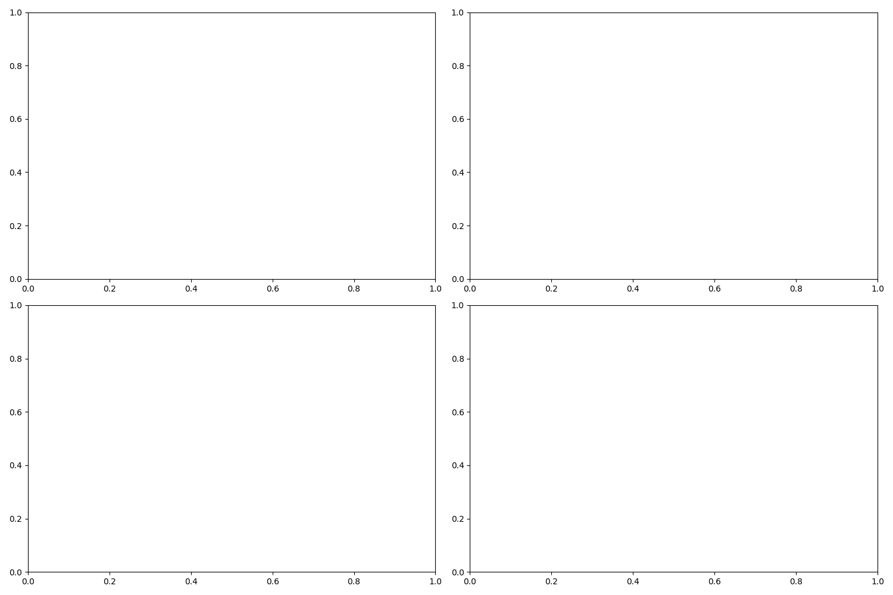

# PCB缺陷检测模型对比实验报告

实验时间: 2025-02-01 12:59:50

## 实验配置

- 设备: cpu
- 基础配置文件: configs/base_config.yaml

## 模型性能对比

### 性能指标

#### YOLO 模型

| experiment_name              | model_type   | model_variant   | metrics                                                                                                                                                                                           |
|:-----------------------------|:-------------|:----------------|:--------------------------------------------------------------------------------------------------------------------------------------------------------------------------------------------------|
| yolo_yolov8n_20250201_124611 | yolo         | yolov8n         | {'precision': 0.01161111111111111, 'recall': 0.6295180722891566, 'mAP50': 0.015020524680860006, 'mAP50-95': 0.004658026914454808, 'f1': 0.02280165830242199, 'training_time': 179.93882083892822} |
#### SMP 模型

| experiment_name          | model_type   | model_variant   | metrics                                                                                                                                                                                                                                                                                          |
|:-------------------------|:-------------|:----------------|:-------------------------------------------------------------------------------------------------------------------------------------------------------------------------------------------------------------------------------------------------------------------------------------------------|
| smp_unet_20250201_124911 | smp          | unet            | {'epoch': 3, 'train_loss': 0.03141074322841384, 'val_loss': 0.03759266948327422, 'learning_rate': 0.001, 'iou': np.float64(0.0), 'precision': np.float64(0.0), 'recall': np.float64(0.0), 'f1': np.float64(0.0), 'accuracy': np.float64(0.9942086537679037), 'training_time': 639.2189099788666} |

### 可视化对比

## 结论和建议

